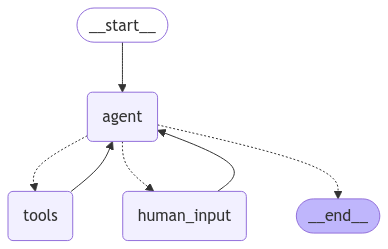

# News Search

## MVP

Currently able to download articles through a langgraph flow, starting with user request, ending with a list of articles presented in a nice format to the user.

- [x] take user input in natural language, containing:
  - topic (a list of words)
  - a date range (YYYY-MM)
- [x] search NTY archive for articles related to the topic for the given date range.

### Current graph



## Steps 


### 1. parse natural language to extract topic and date range

```
      {
        topic,
        start_date,
        end_date
      }
```

    - [x] Works well enough with some vague date ranges, but more testing needed.
    - [ ] determine how to handle errors -- such as when it can't determine the date range or the topic is not clear
    - [ ] the LLM finds the function to use with simple input, but may need to improve the prompt or tool description.

### 2.  search New York times Archive to get summary and url by date range

  - input: topic, start date, end date.
  - output:

```
      [
        {
          pub_date,
          headline,
          abstract,
          lead_paragraph,
          web_url: str
       }
      ]
```
  - [x] download the news items with multiple calls
  - [x] caching to improve performance and avoid API limits

### 3.  use the search results to find interesting articles (filter)
  - [x] basic filter against headline and abstract (lowercase)
  - [ ] add a vector database to do better searches

### 4.  for each topic match: prompt user for interest
  - [ ] show topic info, collect user response

### 6.  for each interest: download the article (TBD how) and save it
  - [ ] hope to use my account creds to download article details for the items user is interested in.

### 7.  for each article saved: ask an LLM for a summary
  - [ ] should be straight-forward to collect this
  - [ ] show the user the list of summaries
  - [ ] save the summary for later review

## NYT Archive API notes

Sample queries to experiment with the API:

Download archives using `curl`

```
curl -s -o nyt-2024-1.json https://api.nytimes.com/svc/archive/v1/2024/1.json?api-key<NYT_API_KEY>
```

Extract key info.  Just to remember how to use `jq`
```
cat nyt-2024-1.json | jq '.response.docs ' | jq 'map({abstract,web_url,snippet,lead_paragraph})'
```