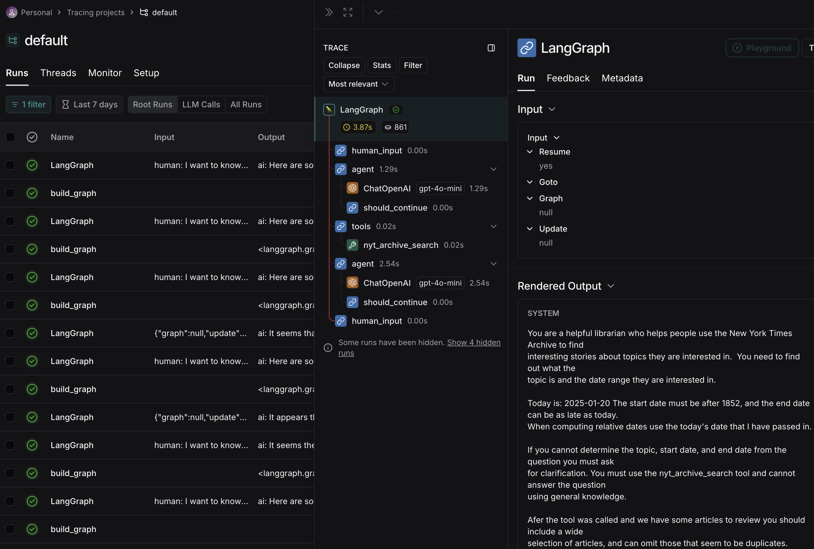

# News Search

## Motivation

- Do something fun with Langchain Agents that's just complex enough to help me learn about what's involved in creating a multi-step agentic flow and evaluating the results.
- Use some public APIs that are easy to use, and free
- Build something that is potentially useful, though that is not a primary concern.

## MVP

Currently we are able to download articles through a langgraph flow, starting with user request, clarifying the user's intent through some back and forth, and ending with a list of articles presented in a nice format to the user.

There are only two tools available:

- New York Times Archive
- Web Search

Depending on what you ask it will use one or both of the tools.

The App works well enough, but we need an evaluation framework to test how well the app works with different inputs.  Trying out RAGAs to see if how it can help with the evaluation.

Tracking some of my ongoing work in [IMPROVEMENTS.md](IMPROVEMENTS.md).

### Langchain graph

This is the current flow:


## Setup Instructions

### Requirements

#### Environment and running the app

- `python 3.12` and `pipenv` I included a couple of script for setting up the project the first time and for running it. You don't need them, but they show one way to do things.

  - [setup.sh](scripts/setup.sh) - to create a local virtual environment and install dependencies
  - [run.sh](scripts/run.sh) - to run `news-search.py`.

#### Access to the [New York Times Developer APIs](https://developer.nytimes.com/apis)

- You can create an account for free, and get an API key:

  ```shell
  NYT_API_KEY=<you-get-this>
  NYT_API_SECRET=<you-get-this>
  ```

#### Access to [Tavily API](https://tavily.com/)

- You can create an account for free, and get an API key:

  ```shell
  TAVILY_API_KEY=<you-get-this>
  ```

  You can make up to 1000 requests per month for free.  They offer a pay as you go plan,
  but I haven't used it enough to bother with that yet.

#### Access to [OpenAPI Developer Platform](https://platform.openai.com/docs/overview)

This is pay-per-use, but using `gpt-4o-mini`, as we are here, is really inexpensive: For 1 million tokens as of 1/24/25, it costs:

- $0.15 for Input
- $0.075 for Cached input
- $0.60 for Output

```shell
OPENAI_API_KEY=<you-get-this>
```

#### Access to langsmith

This is also free for non-commercial use. Tracing gives you access to a nice web interface that lets you trace your agentic calls and clearly see the inputs and outputs at every step. Very useful for troubleshooting.

```shell
LANGSMITH_TRACING=true
LANGSMITH_API_KEY=<you-get-this>
```

**Here's an example of what Langsmith looks like:**



## Plans and Progress

### 1. LLM parses natural language to extract topic and date range

```json
      {
        topic,
        start_date,
        end_date
      }
```

### 2. search New York times Archive to get summary and url by date range

- input: topic, start date, end date.
- output:

```json
      [
        {
          pub_date,
          headline,
          abstract,
          lead_paragraph,
          web_url: str
       }
      ]
```

- [x] we download the news items with multiple calls as needed
- [x] cache API results to avoid API limits

### 3. use the search results to find interesting articles (filter)

- [x] initially a basic filter against headline and abstract (lowercase)
- [x] added a vector database which improved the search but added latench for indexing new results.. but we are caching this so we only pay a penalty once per API call.
- [x] re-download and re-index the current month, since the API could return new results since the last time we checked.

### 4. Figure out why the LLM thinks today is in the past

- [x]  It seems that the examples I have given the prompt are good. I have some other ideas about prompt improvements, but it works well enough for now.

### 5. Evaluation

- [ ] I need to evaluate the graph with different inputs, and can handle multi-turn prompts as part of the evaluation, so I can evaluate how the graph responds.  It doesn't make sense to do more until we have a more predictable evaluation for the current tool.

### 5. Possible future steps

- for each topic matched in the list prompt user for interest (should we drill further into this story?)
- for each interest: download the article (TBD how) and save it (hope to use my account creds to download article details for the items user is interested in.. this may prove impossible)
- for each article saved: ask an LLM for a summary
- save the summary for later review

## NYT Archive API notes

Sample queries to experiment with the API:

Download archives using `curl`

```shell
curl -s -o nyt-2024-1.json https://api.nytimes.com/svc/archive/v1/2024/1.json?api-key<NYT_API_KEY>
```

Extract key info. Just to remember how to use `jq`

```shell
cat nyt-2024-1.json | jq '.response.docs ' | jq 'map({abstract,web_url,snippet,lead_paragraph})'
```
